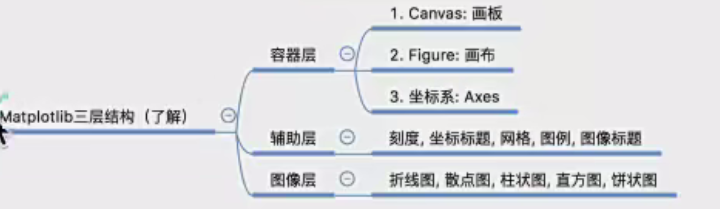

# pro2ml 

###### 用matplot画图

[huatu.py](huatu.py) 简单折线图

绘制基本图像 [basic_pic.py](basic_pic.py) 

一张图片同时绘制两个坐标图 [two_pic.py](two_pic.py) 

剩余部分见[教程](https://www.runoob.com/matplotlib/matplotlib-line.html)

# [TODO]()
