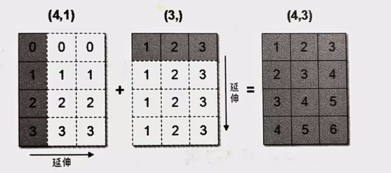

# pro2ml 

###### 用matplot画图

 [1_basic_pic.py](1_basic_pic.py) 简单折线图


一张图片同时绘制两个坐标图 [two_pic.py](2_two_pic.py) 

剩余部分见[教程 ](https://www.runoob.com/matplotlib/matplotlib-line.html)


###### numpy 

[np_1.py](3_np_1.py) 常用numpy数组的构建

[np_2_compute.py](4_np_2_compute.py)numpy数组的运算和统计方法


下图为广播机制,满足下列其中一个条件即可触发广播,扩充短的维度为长的

1数组的某一维度等长
2其中一个数组的某一维度为1。




对于np.dot和np.matmul,都是矩阵乘法区别在于

- *np.dot*可以处理一维数组和标量的乘法，而*np.matmul*不能。
- 在处理二维数组时，*np.dot*和*np.matmul*的结果相同，都是矩阵乘积。
- *np.matmul*在处理高维数组时更加灵活，它可以处理多个数组的矩阵乘积，并且可以自动广播数组以匹配维度。

如果你需要计算标量或一维数组的点积，或者是两个二维数组的矩阵乘积，*np.dot*是合适的选择。如果你需要处理高维数组的矩阵乘积，并且希望利用自动广播的特性，那么*np.matmul*将是更好的选择


### ML概念

通过数据+算法实现功能,而不是仅靠基于规则的学习(if..else),让程序自己从数据中提取特征

##### 监督学习

给出特征值(feature)和目标值(labal),训练能完成分类或回归的模型

###### 分类:结果是已知的离散值

###### 回归:结果为连续值

##### 无监督学习

所给数据没有目标值,只有特征值

###### 聚类:为已有数据进行分类

###### 数据降维:清除噪声,压缩数据

##### 半监督学习

利用**少量**已有**标签**的数据训练模型
再利用该模型套用未标记数据
最后进行人工优化

###### 纯半监督学习:未标记样本不是待测数据

###### 直推学习(transductive learning):未标记样本就是待测数据

##### 强化学习RL

强化学习不像无监督学习那样完全没有学习目标，又不像监督学习那样有非常明确的目标（即
lbel),强化学习的目标一般是变化的、不明确的，甚至可能不存在绝对正确的标签
一般强化学习通过设置一个Agent,通过与环境的交互来获得奖励或惩罚,目标是长期利益最大化

##### 欠拟合

训练集上表现差:一般是模型过于简单
下述方法可以解决或者缓解欠拟合
 ①添加新特征,特征添加二次或三次项
 ②复杂化模型
 ③减少正则化


红字的欠拟合和过拟合是指上面的v字线

##### 过拟合

 ①清洗数据
 ②增大训练数据量

######  ③正则化(减少高次项)

###### ·L2正则化

。作用：可以使得其中一些W的都很小，都接近于0，削弱某个特征的影响
。优点：越小的参数说明模型越简单，越简单的模型则越不容易产生过拟合现象

###### 。Ridge岭回归(常用<a name="岭回归"></a>

$$
J(\theta) = \text{RSS} + \alpha \sum_{i=1}^{n} \theta_i^2
$$

RSS为残差,从而减少回归参数

·L1正则化
。作用：可以使得其中一些W的值直接为0，删除这个特征的影响
。LASSO回归(特征较少时使用
$$
J(\theta) = \text{RSS} + \alpha \sum_{i=1}^{n} |\theta_i|
$$

###### 弹性网络Elastic Net(常用

$$
J(\theta) = \text{MSE}(\theta) + \alpha \sum_{i=1}^{n} |\theta_i| + \frac{1-\rho}{2} \alpha \sum_{i=1}^{n} \theta_i^2
$$

通过参数r控制L1和L2的比例

 ④dropout
 ⑤早停


##### 标准化

$$
X_i=\frac{x_i - mean}{\sigma_i}
$$

标准化后数据均值为0,标准差为1,

```python
from sklearn.preprocessing import StandardScaler
transformer =StandardScaler()
data=transformer.fit_transform(data)
```

可以通过上述代码实现特征归一化

##### 特征提取<a id="特征提取"></a>

任意数据（如文本或图像）转换为可用于机器学习的数宇特征(如图片变为rgb或yuv矩阵)


#### sklearn

一个机器学习包,提供 **分类,回归,聚类,降维(特征工程),模型选择,调优** 六大模块

#### 1.1 K-近邻算法(KNN)概念 [k_neighbor.py](5_k_neighbor.py) 

K Nearest Neighbor算法又叫KNN算法，这个算法是机器学习里面一个比较经典的算法，总体来说KNN算法
是相对比较容易理解的算法

##### ·定义

样本类别定义为k个距离最近的样本中的众数的类别
KNN使用欧氏距离


##### 距离度量

###### 欧氏距离：

$$
d(\mathbf{x}, \mathbf{y}) = \sqrt{\sum_{i=1}^{n}(x_i - y_i)^2}
$$

###### 曼哈顿距离

 

黄色,蓝色,红色为曼哈顿距离,公式如下
$$
d(\mathbf{x}, \mathbf{y}) = \sum_{i=1}^{n} \left| x_i - y_i \right|
$$

###### 切比雪夫距离


$$
d(\mathbf{x}, \mathbf{y}) = \max_{1 \leq i \leq n} \left| x_i - y_i \right|
$$

###### 闵可夫斯基距离

$$
d(\mathbf{x}, \mathbf{y}) = \left( \sum_{i=1}^{n} \left| x_i - y_i \right|^p \right)^{\frac{1}{p}}
$$

p=1时为曼哈顿距离

p=2时为欧氏距离

P→∞时为切比雪夫距离

上述距离存在一些问题,由于数据量纲不同,直接套用距离显然不太合适

###### 标准化欧氏距离公式

标准化欧氏距离在计算欧氏距离时考虑了各个特征的尺度差异，其公式为：

$$
d(\mathbf{x}, \mathbf{y}) = \sqrt{ \sum_{i=1}^{n} \left(\frac{x_i - y_i}{\sigma_i}\right)^2 }
$$

$$
\sigma_i 为第 i 个特征的标准差。
$$

这种距离度量在特征具有不同单位或量纲时非常有用，通过先对各个特征进行标准化，再计算欧氏距离，从而消除了不同尺度带来的影响。


###### 余弦距离

$$
\text{cosine similarity} = \frac{\sum_{i=1}^{n} X_i Y_i}{\sqrt{\sum_{i=1}^{n} X_i^2}\sqrt{\sum_{i=1}^{n} Y_i^2}}
$$


还有汉明距离,杰卡德距离,马氏距离...


##### 连续属性与离散属性

若属性值之间存在序关系，则可以将其转化为连续值，例如：身高属性“高”“中等“矮”，可转化为
{1,0.5,0}
			闵可夫斯基距离可以用于有序属性，
若属性值之间不存在序关系，则通常将其转化为向量的形式，例如：性别属性"男"“女”，可转化为
{0,1}

##### k值的选择

**近似误差**:训练集误差,太小可能过拟合
**估计误差** :测试集误差,越低越好

·K值过小：
。容易受到异常点的影响(过拟合
k值过大：
。受到样本均衡的问题,样本分布构建的模型有问题(模型太简单
取极端例子,k=n时任何预测均为样本的众数,失去了判断能力

一般而言,k值的选择通过交叉验证法找出最优k值

##### kd树

kd树在维度<20时效率较高,更高维度的数据可以使用ball tree

目的:优化k临近算法,提高knn的搜索效率,减少距离计算次数
原理:AB远,BC近,则AC远,从而降低运算复杂度

将时间复杂度从O(D*N^2)降低至O(DNlogN)

构造:通过对k维空间进行分割(超平面),用**中位数**递归生成子节点,产生一颗**平衡二叉树**
一般而言,选择分割的维度时会选择数据较为分散的维度(用**方差**来判断)
构建时**相邻两层的划分维度必定不相同**(正交划分)

搜索:从根节点向下遍历,找出最终归属的区域,与对应的节点求出距离即可(logN)

下面左图为辅助理解超平面,右图为树结构,⭐为要查找的点

**不跨域搜索:**


不跨域是因为(5,4)到(4,7)的距离＞最小距离,因此无需查找另外一侧

**跨域搜索:**


跨域搜索(2,3)是因为当前最小距离>(5,4)到(2,3)的距离

上图所说的画圆只是辅助理解,实际上还是求两点间距离

搜索过程:
①从根节点开始,比较**待查询节点和分裂节点的分裂维的值**(小于进左子树,大于进右子树
②**沿着搜索路径找到最近邻近似点**
③**回溯搜索路径**,如果存在可能比当前距离更近的点,则跳转到其他子节点空间
④重复上述过程直至**搜索路径**为空


##### 损失函数

用于衡量数据拟合程度
**线性拟合**的损失函数一般用最小二乘法

损失函数公式：(欧式距离的平方)
$$
J(w) = \sum_{i=1}^{m} (h(x_i) - y_i)^2
$$
正则化,标准化数据  [Standard.py](6_Standard.py) 


#####  [knn_2.py](7_knn_2.py) 使用knn对提供的数据集进行拟合和划分

在程序中存在两个函数fit_transform()和transform()

**`fit_transform()` 方法：**

- **功能**：首先对数据进行拟合（`fit`），计算所需的统计量（如均值、标准差等），然后立即对数据进行转换（`transform`）。

  在上述代码中，`fit_transform()` 首先计算训练数据 `X_train` 的均值和标准差，然后使用这些统计量对 `X_train` 进行标准化处理。

**`transform()` 方法：**

- **功能**：使用在 `fit` 阶段计算得到的统计量，对新的数据进行转换。
- **使用场景**：用于测试数据集或任何新的数据集，以**确保训练集和测试集使用相同的转换标准**。

因此程序中

```python
x_train = transfer.fit_transform(x_train)
# x_test = transfer.fit_transform(x_test)
x_test = transfer.transform(x_test)#因为都使用标准化方法,因此上下二式子等价(相同fit)
```

最后两行等价

##### 总结

###### 优点：

。简单有效
。重新**训练的代价低**
。**适合类域交叉样本**(不同类别的样本存在交叉或重叠的情况)
	·KNN方法主要靠周围有限的邻近的样本，而不是靠判别类域的方法来确定所属类别的，因此对于类域的交叉或重叠较多的待分样本集来说，KNN方法较其他方法更为适合。
。**适合大样本自动分类**
	·该算法比较适用于样本容量比较大的类域的自动分类，而那些样本容量较小的类域采用这种算
法比较容易产生误分。

###### ·缺点：

。惰性学习
·KNN算法是懒散学习方法(lazy learning,**基本上不学习**)，一些积极学习的算法要快很多
。类别**评分不是规格化**,没有分类概率
。输出**可解释性不强**
。对**不擅长不均衡的样本**

##### 交叉验证

数据分成k组,每次取1组作为验证集,其他作为测试集,求准确率;不同测试集验证k次后结果求平均即为交叉验证的准确率

##### 网格搜索

手动设置超参数过于复杂,因此通过对模型预设的超参数组合进行交叉验证,选出最优参数组合较为合理,下面是网格搜索代码

 [Grid_Search.py](8_Grid_Search.py)

```python
estimator = GridSearchCV(estimator, param_grid=param_dict, cv=5)
#param_grid为待被筛选的超参数字典； cv为交叉验证的折数,estimator为实例化后的算法模型对象
```

准确率和最佳结果不一样,是因为交叉验证使用了测试集作为训练集的一部分,因此准确率较高
(代码26,27行

##### 用knn算法参加比赛

 [比赛链接](https://www.kaggle.com/competitions/facebook-v-predicting-check-ins/data),数据已在本文件夹中 
[Fcaebook_example.py](9_Fcaebook_example.py) 实际处理,实际还是使用之前的函数


### 线性回归linear regression


###### 线性关系

公式如下,其中w,x均为列向量
$$
h(x)==w_1 x_1 +w_2 {x_2}+w_3 {x_3}+ b=w^T x + b
$$

###### 非线性关系

存在高次项的是非线性关系,例子公式如下
$$
h(x)=w_1 x_1 +w_2 {x_2}^2+w_3 {x_3}^3+ b \\
其中
\mathbf{x} =
\begin{bmatrix}
x_1 \\
x_2 \\
x_3
\end{bmatrix}
\mathbf
\qquad{w} =
\begin{bmatrix}
w_1 \\
w_2 \\
w_3
\end{bmatrix}
$$

对于线性回归,我们常用的**损失函数**如下:
$$
J(w) = (h(x_1) - y_1)^2 + (h(x_2) - y_2)^2 + \cdots + (h(x_m) - y_m)^2 \\
= \sum_{i=1}^{m} (h(x_i) - y_i)^2
$$

##### 损失函数

通过计算一个数值，表示模型预测的准确性或误差大小。在训练过程中，模型的目标是通过调整其参数来最小化损失函数的值，从而提高预测的准确性

###### 损失函数决定了算法的思想

##### 损失函数优化

###### 1.正规方程(t通过矩阵运算得到)

$$
w = (X^T X)^{-1} X^T y
$$

假设最优解存在,那上述公式必然能**一步求得最优结果**(直接求解w)

缺点:特征过于复杂时计算量大(O(n^3))且得不到结果

##### 2.梯度下降(SGD)

梯度:函数上升速率最快的方向

公式如下:
$$
\theta_{i+1} = \theta_{i}-\alpha \cdot J'(\theta_i)\\
\alpha为学习率
$$
学习率太大:错过最低点
学习率太小:走不到最低点(卡在极小值)

对于多个参数,线性方程的损失函数如下所示
$$
 J(\theta_0, \theta_1, \ldots, \theta_n) = \frac{1}{2m} \sum_{j=0}^m \left( h_\theta \left( x_0^{(j)}, x_1^{(j)}, \ldots, x_n^{(j)} \right) - y_j \right)^2 
$$

$$
更新后
\theta_{i+1} =\theta_{i} - \alpha*
\frac{\partial}{\partial \theta_{i}} J(\theta_{0}, \theta_{1}, \ldots, \theta_{n})

\\=\theta_{i} - \alpha \cdot \frac{1}{m} \sum_{j=0}^{m} \left( h_{\theta} \left( x_{0}^{(j)}, x_{1}^{(j)}, \ldots, x_{n}^{(j)} \right) - y_{j} \right) x_{i}^{(j)}
$$

不断迭代θ_i直至损失函数J<一个值

###### 全梯度下降FG

计算所有样本误差,再进行梯度下降,中途不能添加样本

###### 随机梯度下降SG

随机选择单个样本,可以有噪声影响

###### mini-batch

选择一定批量来做下降,上述二者结合体

###### 随机平均梯度下降算法SAG

使用前n-1个梯度和当前梯度的均值,性能高,收敛效果好

```python
from sklearn.linear_model import  LinearRegression #线性回归
from sklearn.linear_model import  SGDRegressor #梯度下降
```

常用函数

 [11_price_predice.py](11_price_predice.py) 训练波士顿房价的线性模型,数据获取部分从网上解决

```python
model = LinearRegression()  # 默认使用正规方程而非梯度下降法
model2 = SGDRegressor(max_iter=1000,learning rate="constant",eta0=0.001)  # 梯度下降法的线性回归,有许多参数可以调节,包括学习率,是否自动降低学习率等
```

两个模型的实例化,SGD有丰富的参数可以调节

##### [岭回归的定义](#岭回归)

为[11_price_predice.py](11_price_predice.py)列出了三个函数,对比了不同训练方法得出的均方差,

```python
from sklearn.linear_model import Ridge, RidgeCV  # 线性回归
```

引入岭回归和支持网格搜索的岭回归(自带最优参数


#### 模型的保存和加载

[11_price_predice.py](11_price_predice.py)文件中存在

```python
model=joblib.load("data.pkl")#模型读取
joblib.dump(model,"./data.pkl")#模型保存
```

### 逻辑回归(Logistic Regression)

分类模型,用于类别的判断

输入:线性回归的结果

##### 激活函数:

sigmoid函数
$$
\sigma(x) = \frac{1}{1 + e^{-h(w)}}= \frac{1}{1 + e^{-W^Tx}}
$$
通过这个激活函数返回一个(0,1)之间的值,可以用于二分类,下图为sigmoid的图形,常用于二分类


**激活函数决定了神经网络的输出形式**，而**损失函数**需要与这种输出形式相匹配，以正确**衡量预测与真实值之间的差异**。

- **分类任务**：
  - **激活函数**：输出层通常使用 **Softmax**（多分类）或 **Sigmoid**（二分类），将输出映射为概率分布。
  - **损失函数**：对应使用**对数似然损失** ,也称**交叉熵损失（Cross-Entropy Loss）**，$\text{Cross-Entropy Loss} = - \sum_{i=1}^{K} y_i \log(p_i)$直接衡量概率分布的差异。
  - **数学优势**：Softmax + 交叉熵的组合在反向传播时梯度计算更高效（梯度简化），避免了数值不稳定性。 
- **回归任务**：
  - **激活函数**：输出层通常使用 **线性激活函数**（无激活），直接输出连续值。
  - **损失函数**：常用 **均方误差（MSE）** 或 **平均绝对误差（MAE）**，衡量预测值与真实值的距离。

````
sklearn.linear_model.LogisticRegression(solver='liblinear',penalty='12',C= 1.0)
````

上述代码为逻辑回归的API,相当于`SGDClassifier(loss="log",penalty="")`,即用交叉熵作为损失函数的随机梯度下降(SAG)

`solver='liblinear'`仅用于one-versus-rest问题(多分类转化为多个二分类),其他参数见代码

对于pandas中的df,
loc：通过行、列的名称或标签来索引
iloc：通过行、列的索引位置来寻找数据
在下述文件中给出了一个访问癌症患者数据的程序,实现了逻辑回归

 [12_breast_cancer_wisconsin_original.py](12_breast_cancer_wisconsin_original.py) 

##### 混淆矩阵

**TP（True Positive）**：真正例，实际为正例且被预测为正例的样本数。

**TN（True Negative）**：真负例，实际为负例且被预测为负例的样本数。

**FP（False Positive）**：假正例，实际为负例但被预测为正例的样本数。

**FN（False Negative）**：假负例，实际为正例但被预测为负例的样本数。
$$
1\,\,\,\,\,\,\,\,\,\,\,\,\,\,\,\,\;预测结果
\\真实结果
\begin{bmatrix} 
\text{TP} & \text{FP} \\
\text{FN} & \text{TN}
\end{bmatrix}
$$

准确度$$
\text{Accuracy} = \frac{TP + TN}{TP + FP + TN + FN}
$$正确率

精确率$$
\text{Precision} = \frac{TP}{TP + FP}
$$**真正例+伪正例**

召回率$$
\text{Recall} = \frac{TP}{TP + FN}
$$**真正例+伪反例**

$\text{F1} = 2 \times \frac{\text{Precision} \times \text{Recall}}{\text{Precision} + \text{Recall}}= \frac{2TP}{2TP+FN+FP}$

```python
sklearn.metrics.classification_report(y_true,y_pred,labels=[真实值标签],target_names=None(替换混淆矩阵的标签,用元组装载))
```

 [12_breast_cancer_wisconsin_original.py](12_breast_cancer_wisconsin_original.py) 代码

##### 分类评估

对于数学天赋,我们笼统认为所有人都没有,正确率高达99.99%
为了解决这种样本不均衡(通常<1:4时)的问题,
我们可以通过ROC曲线和AUC指标来解决

##### ROC曲线和AUC指标

$$
\text{TPR}=\text{Recall} = \frac{TP}{TP + FN}
所有真实类别为1的样本中，预测类别为1的比例\\
\text{FPR}=\frac{FP}{FP + TN}所有真实类别为0的样本中，预测类别为1的比例
$$


ROC 曲线以FPR作为横轴，TPR作为纵轴，展示模型在不同阈值下的表现。随着分类阈值的变化，模型的 FPR 和 TPR 也会相应变化，绘制出的曲线即为 ROC 曲线。

理想情况下,ROC 曲线应尽可能接近左上角，表示模型在高 TPR 的同时保持低 FPR

AUC（Area Under the Curve，曲线下面积）是 ROC 曲线下方的面积，数值范围从 0 到 1。**AUC 值越接近 1，表示模型的分类性能越好**；AUC 值为 0.5 时，表示模型的分类能力与随机猜测相当(等于乱猜)。AUC 提供了一个综合的评估指标，能够有效地比较不同模型的性能。
**AUC 的直观解释是：在所有可能的分类阈值下，模型将正样本的预测分数排在负样本之前的概率。**

缺点:仅适用于二分类的分类器


##### 处理样本不均衡问题

``pip3 install imbalanced-learn``下载该包

   [13_supplement_imblearn.py](13_supplement_imblearn.py) 代码如链接

###### 过采样方法

​	增加数国少那一类样本的数量

###### 欠采样方法

​		减少数量较多那一类样本的数量

**随机过采样**
在少数类中随机选择⼀些样本，然后通过复制所选择的样本生成样本集。

缺点:训练复杂度增加,容易过拟合
优化:使用SMOTE算法(合成少数类过采样技术)

##### **smote**:

在点间做平滑而不是直接重复样本点,


##### 随机欠采样:

可能丢失重要特征


### 决策树

常见的**ID3,C4.5,CART**算法

#### ID3

使用信息熵作为划分属性

###### 信息熵

公式如下
$$
H(X) = - \sum_{i=1}^{n} p(x_i) \log p(x_i)
$$
用不确定性(熵)的减少判断信息含量

例子1：假如有三个类别，分别占比为：{1/3,1/3,1/3}，信息熵计算结果为：

$H=-\frac{1}{3}\log(\frac{1}{3})-\frac{1}{3}\log(\frac{1}{3})-\frac{1}{3}\log(\frac{1}{3})=1.0986$

例子2：假如有三个类别，分别占比为：{1/10,2/10,7/10}，信息熵计算结果为：

$H=-\frac{1}{10}\log(\frac{1}{10})-\frac{2}{10}\log(\frac{2}{10})-\frac{7}{10}\log(\frac{7}{10})=0.8018$

**熵越大，表示整个系统不确定性越大，越随机，反之确定性越强。**

特征$A$对训练数据集D的信息增益$g(D,A)$，定义为集合$D$的熵$H(D)$与特征A给定条件下D的熵$H(D|A)$之差。(划分前-划分后)

$g(D,A)=H(D)-H(D|A)$

其中

$H(D\mid A)=\sum\limits{i=1}^{n}\frac{\mid D_i\mid}{\mid D\mid}H(D_i)=-\sum\limits{i=1}^{n}\frac{\mid D_i\mid}{\mid D\mid}\sum\limits{k=1}^{K}\frac{\mid D{ik}\mid}{\mid D_i\mid}\log_2\frac{\mid D_{ik}\mid}{\mid D_i\mid}$

一般而言，信息增益越大，则意味着**使用属性 a 来进行划分所获得的"纯度提升"越大**。因此，我们可**用信息增益来进行决策树的划分属性选择**， **ID3 决策树**以信息增益为准则来选择划分属性。 

###### 缺点:

信息增益对于可取数目较多的属性有所偏好(比如用序号作为划分属性),因此**C4.5决策树**使用**信息增益率**来选择**最优划分属性**

#### C4.5

使用信息增益率来划分**多叉树**,解决了上述ID3的缺点

##### 信息增益率 (IGR)

信息增益 (IG) 的公式： 
$$
IG(A) = H(D) - H(D \mid A)
$$

其中，
- \( H(D) \) 表示数据集 \( D \) 的熵，
- \( H(D \mid A) \) 表示在特征 \( A \) 条件下的条件熵。

---

**固有值 (IV) 的公式：**
$$
IV(A) = -\sum_{i=1}^{n} \frac{|D_i|}{|D|} \log_2 \left(\frac{|D_i|}{|D|}\right)
$$

其中，
- \( |D_i| \) 是特征 \( A \) 第 \( i \) 个取值对应的数据子集的大小，
- \( |D| \) 是整个数据集的大小。

---

**信息增益率 (IGR) 的公式：**
$$
IGR(A) = \frac{IG(A)}{IV(A)}
$$

#### CART算法

通过比较基尼值划分**二叉树**,基尼值越小越好

###### 基尼值

数据集中任意两个样本标签不一致的概率
$$
Gini(D) = \sum_{k=1}^{|y|} \sum_{k' \neq k} p_k p_{k'} = 1 - \sum_{k=1}^{|y|} p_k^2
$$
基尼值越小,数据集D纯度越高

###### 基尼指数(经过特征a分割后的基尼值

$$
Gini\_index(D, a) = \sum_{v=1}^{V} \frac{D^v}{D} Gini(D^v)
$$

一般会选划分后基尼系数最小的属性作为最优划分属性

其中：

- Gini_index(D,a) 是特征 a 的 Gini 指数。
- D^v 是特征a 的取值 v 对应的子集。
- D 是数据集 D 的总大小。
- Gini(D^v) 是子集 D^v的 Gini 指数。
- V 是特征a 的取值个数。

**CART算法通过基尼指数**实现
CART同时进行了分类和回归,因此**可以处理离散和连续属性**(ID3,C4.5只能处理离散属性)


#### 剪枝

目的:抛开噪声和过拟合,**提升泛化性能**

##### 预剪枝

在决策树生成过程中，对每个结点在划分前先进行估计，若当前结点的划分不能带来决策树泛化性能提升，则停止划分并将当前结点标记为叶结点；

##### 后剪枝

生成一棵完整的决策树，然后自底向上地**对非叶结点进行考察**，若将该结点对应的子树替换为叶结点能带来决策树泛化性能提升，则将该子树替换为叶结点。

##### 总结

后剪枝通常比预剪枝决策树保留了更多的分支。
一般情形下，后剪枝的欠拟合风险很小，**泛化性能往往优于预剪枝**。
后剪枝的训练开销比未剪枝决策树和预剪枝决策树都要大得多

##### 多变量决策树(如OC1)

通过一组特征的线性组合来决策,建议搜索看看原理

##### [特征提取定义](#特征提取)

通过`sklearn.feature_extraction.DictVectorizer()`和`sklearn.feature_extraction.text.CountVectorizer()`实现
[代码](14_feature_vectorizer&tfidf.py) 

###### Tf-idf

- 主要思想：如果某个词或短语在一篇文章中**出现的概率高**，并且**在其他文章中很少出现**，则认为此**词或者短语**具有很好的**类别区分**能力，适合用来分类。

- 作用：用以**评估一字词**对于一个文件集或一个语料库中的其中一份文件的**重要程度**。


##### 决策树算法api

```python
class sklearn.tree.DecisionTreeClassifier(criterion='gini',max_depth=None,random_state=None)
```


-  criterion: 特征选择标准
  - "gini"或者"entropy",前者代表基尼系数，后者代表信息增益。一默认"gini",即CART算法。
- min_samples_split : 内部节点再划分所需最小样本数
  - 这个值限制了子树继续划分的条件，如果某节点的样本数少于min_samples_split,,则不会继续再尝试选择最优特征来进行划分默认值2。如果样本量不大，不需要管这个值。如果样本量数量级非常大，则推荐增大这个值。如10万样本，建立决策树时，可以参考min_samples_splita=10。
-  min_samples_leaf
  - 叶子节点最少样本数
  - 这个值限制了叶子节点最少的样本数，如果某叶子节点数目小于样本数，则会和兄弟节点一起被剪枝。默认是1，可以输入最少的样本数的整数，或者最少样本数占样本总数的百分比。如果样本量不大，不需要管这个值。如果样本量数量级非常大，则推荐增大这个值。10万样本项目参考min_samples._leaf的值为5。
-  max_depth
  - 决策树最大深度
  - 决策树的最大深度，默认可以不输入，如果不输入的话，决策树在建立子树的时候不会限制子树的深度。一般来说，数据少或者特征少的时候可以不管这个值。如果模型样本量多，特征也多的情况下，推荐限制这个最大深度，具体的取值取决于数据的分布。常用的可以取值10-100

###### 案例：预测泰坦尼克号生存概率

[数据集链接](https://www.kaggle.com/c/titanic/overview)

 [代码](C:\Users\Administrator\Desktop\project\pro2ml\15_example_titan.py) 数据集向量化,然后生成决策树,最后保存决策树

生成的树(*.dot)可以在http://webgraphviz.com/中查看


##### 回归决策树

上述决策树均对于离散的目标值实现,
连续值使用回归决策树

⼀个回归树对应着输入空间（即特征空间）的⼀个划分以及在划分单元上的输出值。分类树中，我们采用信息论中的方法，通过计算选择最佳划分点。

而在回归树中，采用的是启发式的方法。假如我们有n个特征，每个特征有s_i(i ∈ (1, n))个取值，那我们遍历所有特征， 尝试该特征所有取值，对空间进行划分，直到取到特征 j 的取值 s，使得损**失函数最小**，这样就得到了⼀个划分点。描述该过程的公式如下：
$$
min_{loss}=\min_{j, s} \left[ \min_{c_1} \sum_{x_i \in R_1(j, s)} (y_i - c_1)^2 + \min_{c_2} \sum_{x_i \in R_2(j, s)} (y_i - c_2)^2 \right] \\
其中c_i为分类R_i中y的均值
$$
通过上述损失(方差)找到最佳分割点()

 [代码](16_compete_liner_and_dec_tree.py) 

```python
from sklearn.tree import DecisionTreeRegressor
```

上述为sklearn的回归决策树,允许使用连续值来进行决策,实际对比可以看图


### 集成学习

- 什么是集成学习
  - 通过建立几个模型来解决单一预测问题
- 机器学习两个核心任务
  - 1.解决欠拟合问题
    - 弱弱组合变强
    - boosting
  - 2.解决过拟合问题
    - 互相遏制变壮
    - Bagging

。

#### 2.1 Bagging集成原理

**1.采样不同数据集**
**2.训练分类器**
**3.平权投票，获取最终结果**

即通过多个弱分类器,少数服从多数实现强效果

#### 2.2 随机森林构造过程

**随机森林是一个包含多个决策树的分类器**，并且其输出的类别是由个别树输出的类别的众数而定。

即:**随机森林 = Bagging + 决策树**


例如, 如果你训练了15个树, 其中有4个树的结果是True, 11个树的结果是False, 那么最终投票结果就是False

**随机森林够造过程中的关键步骤**（M表示特征数目）：

1）一次随机选出一个样本，**有放回的抽样**，**重复N次**（有可能出现重复的样本）

2） 随机去选出m个特征, m <<M，建立决策树

**有放回地抽样**:使得树间的训练样本范围相同,最终训练结果相近
**随机抽样训练集**:使得决策树泛化能力强

#### 2.3 包外估计 (Out-of-Bag Estimate)

在随机森林构造过程中，如果进行有放回的抽样，我们会发现，**总是有⼀部分样本我们选不到**。

数据足够多的情况下,包外数据的概率为$$\left(1 - \frac{1}{N}\right)^N = \frac{1}{\left(\frac{N}{N-1}\right)^N} = \frac{1}{\left(1 + \frac{1}{N-1}\right)^N} \approx \frac{1}{e}$$
即被选到的数据约占所有**数据的63%**,因此剩余的37%的未选中的包外数据可**以用作分类器的验证集**(val_data)

#####  2.3.2 包外估计的用途

- 当基学习器是决策树时，可使⽤包外样本来辅助剪枝 ，或用于估计决策树中各结点的后验概率以辅助对零训练样本结点的处理；
- 当基学习器是神经网络时，可使用包外样本来辅助早期停止以减小过拟合 。


#### 2.4 随机森林代码及api

`sklearn.ensemble.RandomForestClassifie()`分类

`sklearn.ensemble.RandomForestRegressor()`回归

n_estimators : 推荐0-200之间的数值
这是森林中树木的数量，即基评估器的数量。

Criterion（default =“gini”）分割特征的测量方法

random_state ：控制生成随机森林的模式。并不能控制森林中的树的样式。随机性越大，模型效果越好，当然这样可能就不是很稳定，不便于调试。想要模型稳定，可以设置random_state参数

bootstrap ：控制抽样技术的参数，默认为True。采用有放回的随机抽样数据来形成训练数据。

oob_score ：默认为False，True表示用包外数据来测试模型。可以通过oob_score_来查看模型的准取度。

max_depth：default=None，树的最大深度 

max_features: default ="auto”,每个决策树的最大特征数量

- If “auto” or “sqrt”, max_features=sqrt(n_features).
- If “log2”, then max_features=log2(n_features).
- If None, then max_features=n_features.

min_samples_split:节点划分最少样本数
min_samples_leaf:叶子节点的最小样本数

 [代码中的demo1函数](17_compete_random_forest_GBDT_XGB.py) 

#### 2.5 boosting

**随着学习的积累从弱到强**,每加入一个弱学习器,整体能力就会得到提升,每一次学习都强化判断错误的数据,削弱判断正确的数据


#### 2.6 bagging集成与boosting集成的区别

##### 2.6.1 数据方面

Bagging：对数据进行采样训练；
Boosting：根据**前⼀轮**学习**结果**调整数据的重要性。

##### 2.6.2 投票方面

Bagging：所有学习器**平权投票**；
Boosting：对学习器进行**加权投票**。

##### 2.6.3 学习顺序

Bagging的学习是并行，学习器间没有依赖关系；
Boosting的学习是串行，后一个学习器依赖前一个

##### 2.6.4 主要作用

Bagging主要用于提高泛化性能（解决过拟合，降低方差）
Boosting主要用于提高训练精度 （解决欠拟合，降低偏差）

$$F_{m}(x)$$为拥有m个弱学习器的强学习器 ,  $$G_m(x)$$ 是第m次迭代产生的弱学习器,且  $$G_m(x)$$={+1 , -1} ,$$F_{m}(x)$$公式如下
$$
F_m(x) = F_{m-1}(x) + \alpha_m G_m(x)\\
其中 \alpha_{m+1}={1/2}*ln(
\frac{1-\varepsilon_m} {\varepsilon_{m}} )
$$
对于上述强分类器$$F_{m}(x)$$,其损失函数可以表达为
$$
L(x, y) = L(F_{m-1}(x) + \alpha_m G_m(x), y)
$$


经过第t轮的分类器的分类后,第t+1轮特征的权重分布
$$
D_{t+1}(x) = \frac{D_t}{Z_t} \times 
\begin{cases} 
e^{-a t}, & \text{if 预测正确} \\
e^{a t}, & \text{if 预测错误} \\
\end{cases}
\\
 
其中 Z_t=e^{\alpha_t}*\varepsilon_m+e^{-\alpha_t}*(1-\varepsilon_m)
$$

最终,分类器可以定义为
$$
H_3(x) = \text{sign}\left[
\sum_{i=1}^{n} \alpha_{i}h_i(x)
\right]
$$

###### boost api

`from sklearn.ensemble import AdaBoostClassifier`
adaboost的类,用法和之前的方法类似

#### 2.7 GBDT(Gradierit Boosting Decision Tree,梯度提升树)

##### 2.7.1 Decision Tree

GBDT的Decision Tree使用的是**CART回归树**,因为每次迭代要**拟合梯度值(残差)**,因此使用回归树才能求出梯度 

##### 2.7.2 Gradierit Boosting 

利用损失函数的梯度作为提升树算法中残差(方差)的近似值, 下面公式的$$Loss{(\frac{1}{2}(y_i-c)^2)}$$,实际上**GBDT的损失函数可以是任意可微函数**

$$
\sum_{i=1}^{N}\frac{\partial  L(y_i, c)}{\partial c}  = \sum_{i=1}^{N} \frac{\partial(\frac{1}{2}(y_i-c)^2)}{\partial c}= \sum_{i=1}^{N}c-y_i
$$
  初始化时令$$c=\frac{1}{N}\sum_{i=1}^{N}y_i$$

 

- **输入**：训练数据集 \( D \)；
- **输出**：回归树 \( f(x) \)。

在训练数据集所在的输入空间中，递归地将每个区域划分为两个子区域并决定每个子区域上的输出值，构建二叉决策树：

1. 选择最**优分割特征$$j$$ 与分割点 $$s$$**，求解
   $$
   \min_{j,s} \left[ \sum_{x_i \in R_1(j,s)} (y_i - c_1)^2 + \min_{c_2} \sum_{x_i \in R_2(j,s)} (y_i - c_2)^2 \right]
   $$
   即找出一个对(j,s),使得上述损失函数最低,

2. 用选定的对 \( (j,s) \) 划分区域并**决定相应的输出值**：
   $$
   R_1(j,s) = \{x | x^{(j)} \leq s\}, \quad R_2(j,s) = \{x | x^{(j)} > s\}
   
   \\
   c_m = \frac{1}{N} \sum_{x_i \in R_m(j,s)} y_i, \quad x \in R_m, \quad m = 1, 2
   $$
   
3. 继续对两个子区域递归调用 步骤1,2 ，直至满足停止条件。

4. 将输入空间划分为 \( M \) 个区域 \( R_1, R_2, \ldots, R_M \)，生成决策树：
   $$
   \begin{align*}
   f(x) = \sum_{m=1}^M \hat{c}_m I(x \in R_m)
   \end{align*}
   $$
    [代码中的demo2函数](17_compete_random_forest_GBDT_XGB.py) 

##### 2.7.3 GBDT的api

```python
from sklearn.ensemble import GradientBoostingClassifier
```

n_estimators: 也就是**弱学习器的最大迭代次数**，或者说最大的弱学习器的个数。一般来说n_estimators太小，容易欠拟合，n_estimators太大，又容易过拟合，一般选择一个适中的数值。默认是100。在实际调参的过程中，我们常常将n_estimators和下面介绍的参数learning_rate一起考虑。

**learning_rate:** 即每个弱学习器的权重缩减系数ν，也称作步长。强学习器的迭代公式为$$f_k ( x ) = f_ {k − 1} ( x ) + ν h_k ( x )$$。ν的取值范围为0<ν≤1。对于同样的训练集拟合效果，较小的ν意味着我们需要更多的弱学习器的迭代次数。通常我们用步长和迭代最大次数一起来决定算法的拟合效果。所以这两个参数n_estimators和learning_rate要一起调参。一般来说，可以从一个小一点的ν开始调参，默认是1。

**subsample: 即子采样**，取值为(0,1]。注意这里的子采样和随机森林不一样，随机森林使用的是放回抽样，而这里是**不放回抽样**。如果取值为1，则全部样本都使用，等于没有使用子采样。如果取值小于1，则只有一部分样本会去做GBDT的决策树拟合**。选择小于1的比例可以减少方差，即防止过拟合**，但是会增加样本拟合的偏差，因此取值不能太低。推荐在[0.5, 0.8]之间，**默认是1.0，即不使用子采样。**

init: 即初始化时候的弱学习器，对应GBDT原理里面的$$f_{0}(x)$$，如果不输入，则用训练集样本来做样本集的初始化分类回归预测。否则用init参数提供的学习器做初始化分类回归预测。一般用在我们对数据有先验知识，或者之前做过一些拟合的时候，如果没有的话就不用管这个参数了。

**loss:** 即我们GBDT算法中的损失函数。分类模型和回归模型的损失函数是不一样的。

对于分类模型，有对数似然损失函数"deviance"和指数损失函数"exponential"两者输入选择。默认是对数似然损失函数"deviance"。一般来说，推荐使用默认的"deviance"。它对二元分离和多元分类各自都有比较好的优化。而指数损失函数等于把我们带到了Adaboost算法。
对于回归模型，有均方差"ls", 绝对损失"lad", Huber损失"huber"和分位数损失“quantile”。默认是均方差"ls"。一般来说，如果数据的噪音点不多，用默认的均方差"ls"比较好。如果是噪音点较多，则推荐用抗噪音的损失函数"huber"。而如果我们需要对训练集进行分段预测的时候，则采用“quantile”。

**alpha：**这个参数只有GradientBoostingRegressor有，当我们使用Huber损失"huber"和分位数损失“quantile”时，需要指定分位数的值。默认是0.9，如果噪音点较多，可以适当降低这个分位数的值。

#### 2.8 XGboost (Extreme Gradient Boosting)极端梯度提升树

[参考链接](https://www.bilibili.com/video/BV1nP4y177rw?vd_source=82d188e70a66018d5a366d01b4858dc1&spm_id_from=333.788.player.switch)

##### 2.8.1 简介

**XGBoost= 二阶泰勒展开+boosting+CART+正则化**

每一轮学习中，XGBoost 对损失函数进行二阶泰勒展开，**使用一阶和二阶梯度进行优化**。

##### 2.8.2 目标函数

对于使用CART树的XGboost , 模型目标函数为损失+复杂度惩罚,即
$$
obj=\min_{f \in F} \frac{1}{N} \sum_{i=1}^{N} L(y_i, f(x_i)) + \Omega(f)\\
其中\Omega(f)为模型f的复杂度\\
\Omega(f)= \gamma T + \frac{1}{2} \lambda \|w\|^2\\
T:叶子节点数\;\;\;\;\gamma:节点分割的难度\\
\;\;\;w:叶子节点向量的模\;\;\;\;\lambda:L2正则 化系数
$$
上式被称为**结构风险最小化** , 可以有效防止过拟合

##### 2.8.3迭代学习模型的目标函数
根据上式，共进行 $ t $ 次迭代的学习模型的目标函数为：

$$
\mathcal{L}^{(t)} = \sum_{i=1}^{n} L(y_i, \hat{y}_i^{(t)}) + \sum_{k=1}^{t} \Omega(f_k)
$$

由**前向分布算法**可知，前 $ t-1 $ 棵树的结构为常数，第 $ t $ 棵树的目标函数为：

$$
\text{obj}^{(t)} = \sum_{i=1}^{n} L(y_i, \hat{y}_i^{(t-1)} + f_t(x_i)) + \Omega(f_t)\\
$$

泰勒公式的二阶导近似表示为：

$$
f(x_0 + \Delta x) \approx f(x_0) + f'(x_0) \cdot \Delta x + \frac{f''(x_0)}{2} \cdot (\Delta x)^2
$$


令 $ f_t(x_i) = \Delta x $，则（3.5）式的二阶近似展开为：

$$
\text{obj}^{(t)} \approx \sum_{i=1}^{n} \left[ L(y_i, \hat{y}_i^{(t-1)}) + g_i f_t(x_i) + \frac{1}{2} h_i f_t^2(x_i) \right] + \Omega(f_t)+常数\\
仅展开f_t(x_i)这一项,其余n-1项均为常数\\
其中\;g_i为f'(x_0) \;\;\;\;\;h_i为f''(x_0)
$$

$$
\text{obj}^{(t)} = \sum_{i=1}^{n} \left[ g_i \cdot f_t(x_i) + \frac{1}{2} h_i \cdot f_t(x_i)^2 \right] + \gamma T + \frac{1}{2} \lambda \sum_{j=1}^{T} w_j^2
$$


**解释**：

- 第一部分是对所有训练样本集进行累加。
- 此时，**所有样本都映射为树的叶子节点**。(样本空间其实就是叶子节点的输出)

换种思维，**从叶子节点出发**，对所有的叶子节点进行累加：

$$
\text{obj}^{(t)} = \sum_{j=1}^{T} \left[ \left( \sum_{i \in I_j} g_i \right) w_j + \frac{1}{2} \left( \sum_{i \in I_j} h_i + \lambda \right) w_j^2 \right] + \gamma T\\
=\text{obj}^{(t)} = \sum_{j=1}^{T} \left[ \left( G_i  \right) w_j + \frac{1}{2} \left( H_i + \lambda \right) w_j^2 \right] + \gamma T
$$

- $ G_j $ 表示映射为叶子节点 $ j $ 的所有输入样本的一阶导之和。
- $ H_j $ 表示映射为叶子节点 $ j $ 的所有输入样本的二阶导之和。
- $ w_j $ 是第 $ j $ 个叶子节点的权重。
- $ \gamma $ 和 $ \lambda $ 是正则化参数。


对于第 $ t $ 棵 CART 树的某一个确定结构（可用 $ q(x) $ 表示），其叶子节点是相互独立的，$ G_j $ 和 $ H_j $ **是确定量**。因此，可以看成是关于叶子节点 $ w $ 的一元二次函数。**最小化(导数值=0)**$$obj^{(t)}$$，得：

$$
w_j^* = -\frac{G_j}{H_j + \lambda}
$$

**回代原式**，得到最终的打分函数（scoring function）：
$$
\text{obj}^* = -\frac{1}{2} \sum_{j=1}^{T} \frac{G_j^2}{H_j + \lambda} + \gamma T
$$

- 它是衡量**树结构好坏**的标准。
- **值越小**，代表这样的结构越好。
- 我们用**打分函数选择最佳切分点**，从而构建 CART 树。


 

##### 2.8.4 树形选择

- 穷举法列出所有树形(开销太大,不现实)

- 精确贪心算法,图示如下

  

  - 信息增益,这里用作**目标值的减少程度**,由上式可知增益公式如下

  - $$
    gain=obj_{前}^* -obj_{后}^* =obj_{前}^*-obj_{后L}^*-obj_{后R}^*  \\
    =
    \frac{1}{2} 
    \sum_{j=1}^{T} [
    \frac{G_L^2}{H_L + \lambda} +
    \frac{G_j^2}{H_R + \lambda} -
    \frac{{(G_j+G_R)}^2}{H_R + H_R+\lambda}]-\gamma\\
    其中\gamma为引入新叶子节点的代价
    $$
    
  - 由贪心算法选择增益最小的结构即可,下面**是节点不分割的情况**
    1. 所有分割增益均≤0,则不分割
    2. 页叶子宽度或树的深度到达阈值
    3. 叶子节点**权重和达到阈值**或**叶子节点**包含**样本数量太少**

##### 2.8.5 XGBoost.与GDBT的区别

###### 区别一：

。XGBoost**生成CART树考虑了树的复杂度**，
。GDBT未考虑，GDBT在树的剪枝步骤中考虑了树的复杂度。

###### ·区别二：

。XGBo0st是拟合上一轮损失函数的**二阶导展开**，GDBT是拟合上一轮损失函数的一阶导展开，因此，**XGBoost**
**的准确性更高**，且满足相同的训练效果，需要的迭代次数更少。

###### ·区别三：

。XGBoost与GDBT都是逐次迭代来提高模型性能，但是**XGBoost在选取最佳切分点时可以开启多线程**进行


##### 2.8.6 api以及代码

 [demo3](17_compete_random_forest_GBDT_XGB.py) 

###### 2.8.6.1 通用参数(general parameters)

1. booster[default=gbtree]

2. 决定使用哪个booster,可以是gbtree,gblinear或者dart。

   gbtree和dart使用基于树的模型(dart主要多了Dropout),而gblinear使用线性函数.

3. 3.silent[default=0]

   设置为0打印运行信息；设置为1静默模式，不打印

4. nthread[default=最大线程数]

   并行运行xgboost的线程数，输入的参数应该<=系统的CPU核心数，若是没有设置算法会检测将其设置为CPU的全部核心数


下面的两个参数不需要设置，使用默认的就好了

1. num_pbuffer[xgboost自动设置，不需要用户设置]

   预测结果缓存大小，通常设置为训练实例的个数。该缓存用于保存最后boosting:操作的预测结果。

2. num_feature[xgboost自动设置，不需要用户设置]

   在poosting中使用特征的维度，设置为特征的最大维度


###### 2.8.6.2 Booster 参数（booster parameters）

1. beta

- **default**=0.3
- **作用**: 更新中减少的步长来防止过拟合。在每次 boosting 之后，可以直接获得新的特征权值，这样可以使得 boosting 更加鲁棒。
- **范围**: [0, 1]

2. gamma

- **default**=0
- **作用**: 在节点分裂时，只有分裂后损失函数的值下降了，才会分裂这个节点。Gamma 指定了**节点分裂所需的最小损失函数下降值**。这个参数的值越大，算法越保守。

3. max_depth(**default**=6)  这个值为树的最大深度

4. min_child_weight(**default**=1),决定最小叶子节点样本权重和。XGBoost 的**这个参数是最小样本权重的和**。当它的值较大时，可以避免过拟合

5. subsample(**default**=1), 控制对于每棵树随机采样的比例。减小这个参数的值，算法会更加保守，避免过拟合。

- **典型值**: 0.5-1，0.5 代表平均采样，防止过拟合。

6. colsample_bytree(**default**=1) , 用来控制每棵随机采样的列数的占比（每一列是一个特征）,即上面的m

- **典型值**: 0.5-1

7. colsample_bylevel(**default**=1)

- **作用**: 用来控制树的每一级的每一次分裂，对列数的采样的占比。我个人一般不太用这个参数，因为 subsample 参数和 colsample_bytree 可以起到相同的作用。但是如果感兴趣，可以挖掘这个参数更多的用处。
- **范围**: (0, 1]

8. lambda(**default**=1)

- **别名**: reg_lambda
- **作用**: 权重的 **L2 正则化项**（和 Ridge regression 类似）。这个参数是用来控制 XGBoost 的正则化部分的数据科学家很少用到这个参数，但是这个参数在减少过拟合上是可以挖掘出更多用处的。

9. alpha(**default**=0)

- **作用**: 权重的 **L1 正则化项**（和 Lasso regression 类似）。可以应用在很高维度的情况下，使得算法的速度更快。

10. scale_pos_weight(**default**=1)

- **作用**: 在各类别**样本十分不平衡时，把这个参数设定为一个正值，可以使算法更快收敛**。通常可以将其设置为负样本的数目与正样本数目的比值。


###### 2.8.6.3 学习目标参数（task parameters）

1. Objective [缺省值=reg:linear]

- **reg:linear**  线性回归  
- **reg:logistic**  逻辑回归  
- **binary:logistic**  二分类逻辑回归，输出为概率  
- **multi:softmax**  使用 softmax，返回预测的类别（不是概率）。在这种情况下，你还需要多设一个参数：`num_class`（类别数目）  
- **multi:softprob**   `multi:softmax` 参数一样，但是返回的是每个数据属于各个类别的概率  

2. eval_metric [缺省值=通过目标函数选择]

可供选择的如下所示：  
- **rmse**  均方根误差  
- **mae**  平均绝对值误差  
- **logloss**  负对数似然函数值  
- **error**  二分类错误率。其值通过错误分类数目与全部分类数目比值得到。对于预测，预测值大于 0.5 被认为是正类，其它归为负类  
- **error@t**  不同的划分阈值可以通过 `t` 进行设置  
- **merror**  多分类错误率，计算公式为 `(wrong cases) / (all cases)`  
- **mlogloss**  多分类 log 损失  
- **auc**  曲线下的面积  

##### 2.8.7 [otto案例--xgboost实现](https://blog.csdn.net/qq_46092061/article/details/119118763)

###### 分层抽样

概念：
一般地，在抽样时，将总体分成互不交叉的层，然后按照一定的比例，从各层独立地抽取一定数量的个体，将各层取出的个体合在一起作为样本，这种抽样的方法叫分层抽样

```python
sklearn.model_selection.StratifiedShuffleSplit(n_splits=10, test_size=’default’, train_size=None, random_state=None)
```

参数 n_splits是将训练数据分成train/test对的组数
test_size和train_size是用来设置train/test对中train和test所占的比例
这个函数返回的是数据集的索引，而不是直接分割数据

用法:如下

```python
def demo0():#分层随即划分的用法
    X = np.array([[1, 2], [3, 4], [1, 2], [3, 4], [1, 2]])
    Y = np.array([0, 0, 0, 1, 1])
    ss = StratifiedShuffleSplit(n_splits=5, test_size=0.5, random_state=0)

    for train_index, test_index in ss.split(X, Y):
        #注意,这个分类器返回的是索引而非值
        # print("训练集索引",train_index)
        for i in train_index:
            print("训练集特征值为",X[i],"目标值为",Y[i])
        # print("测试集索引",test_index)
        for i in train_index:
            print("测试集特征值为",X[i],"目标值为",Y[i])
```

py如果发现样本**存在严重的数据不平衡**问题，比如正负样本的比例相差的很大，那么这时候就有必要进行分层抽样
其次，如果不是分类任务，而是其他的任务比如**回归任务**，也**可以使用分层抽样**
数据集**样本数量很大**（远远大于属性个数）的时候，其实随**机和分层的效果差不多**。


###### PCA:主成分分析

```python
from sklearn.decomposition import PCA
pca = PCA(n_components=0.9)#代表满足最低的主成分方差累计贡献率至少达到0.9

x_train_pca = pca.fit_transform(x_train_scaled)
x_val_pca = pca.transform(x_val_scaled)
```

通过PCA降维减少特征数,且保留尽可能多的信息

[用法](https://blog.csdn.net/weixin_44781900/article/details/104839136)

##### 2.8.8 XGBoost对比GDBT

1. XGBoost在建立时就考虑了树的复杂度问题,而GDBT仅在后剪枝阶段考虑到
2. 开启切分点时XGBoost可以使用多线程
3. XGBoost使用了二阶导,相较于使用梯度的GDBT更加精确


#### 2.9 lightGBM

##### 2.9.1  AdaBoost算法

AdaBoost是一种提升树的方法，和三个臭皮匠，赛过诸葛亮的道理一样。
AdaBoostp两个问题：

1. 如何改变训练数据的权重或概率分布

   提高前一轮被弱分类器错误分类的样本的权重，降低前一轮被分对的权重

2. 如何将弱分类器组合成一个强分类器，亦即，每个分类器，前面的权重如何设置

   采取”多数表决”的方法加大分类错误率小的弱分类器的权重，使其作用较大，而减小分类错误率大的弱分类器的权重，使其在表决中起较小的作用。

##### 2.9.2 GBDT算法以及优缺点

###### 2.9.2.1 GBDT 和 AdaBoost 的比较

GBDT 和 AdaBoost 很类似，但是又有所不同。

- **GBDT** 和其他 Boosting 算法一样，通过将表现一般的几个模型（通常是深度固定的决策树）组合在一起来集成一个表现较好的模型。

- **AdaBoost** 是通过提升错分数据点的权重来定位模型的不足，而 **Gradient Boosting** 通过负梯度来识别问题，通过计算负梯度来改进模型。即通过反复地选择一个指向负梯度方向的函数，该算法可被看作在函数空间里对目标函数进行优化。

因此可以说：

- **Gradient Boosting = Gradient Descent + Boosting**

###### 2.9.2.2 GDBT缺点

1. **空间消耗大**。

2. **计算复杂度高**：
   - 由于 GBDT 需要对每个特征进行预排序，计算复杂度较高，尤其是在处理大规模数据集时，训练时间会显著增加。

3. **对内存(cache)优化不好**
   - GBDT 在训练过程中会不断拟合残差，因此对噪声数据较为敏感，容易过拟合。
   - 在预排序后，特征对梯度的访问是一种随机访问，并且不同的特征访问的顺序不一样，无法对cace进行优化。
     同时，在每一层长树的时候，需要随机访问一个行索引到叶子索引的数组，并且不同特征访问的顺序也不一样，也会造成较大的cache miss。
   
4. **难以并行化**：
   - 由于 GBDT 是基于决策树的串行模型，每次迭代依赖于前一次的结果，因此难以实现并行化训练。

###### 2.9.2.3 启发

常用的机器学习算法，例如神经网络等算法，都可以以 **mini-batch** 的方式训练，**训练数据的大小不会受到内存限制**。

而 **GBDT** 在每一次迭代的时候，都需要遍历整个训练数据多次。

如果把整个训练数据装进内存则会限制训练数据的大小；如果不装进内存，反复地读写训练数据又会消耗非常大的时间。

尤其面对工业级海量的数据，普通的 **GBDT** 算法是不能满足其需求的。

**LightGBM** 提出的主要原因就是为了解决 **GBDT** 在海量数据遇到的问题，让 **GBDT** 如何更好更快地用于工业实践。

##### 2.9.3 lightGBM原理

lightGBM 主要基于以下方面优化，提升整体特特性：

1.基于**（直⽅图）**的决策树算法
2.Lightgbm 的Histogram（直⽅图）**做差加速**
3.带深度限制的**Leaf-wise的叶⼦生长策略**
4.直接⽀持**类别特征**
5.直接⽀持高效**并行** 

###### 2.9.3.1 Histogram(直方图)


如上图所示,直方图算法实际上是**将连续值转变为离散值**,从而降低存储和计算的代价
(0,1] ,(1,2] ,(2,3)...以此类推

当然，Histogram.算法并不是完美的。由于特征被离散化后，**找到的并不是很精确的分割点**，所以会对结果产生影响。但在不同的数据集上的结果表明**，离散化的分割点对最终的精度影响并不是很大，甚至有时候会更好一点**。原因是决策树本来就是弱模型，分割点是不是精确并不是太重要；**较粗的分割点也有正则化的效果**，可以有效地防止过拟合；即使单棵树的训练误差比精确分割的算法稍大，但在梯度提升(Gradient Boosting)的框架下没有太大的影响。

###### 2.9.3.2 Lightgbm 的Histogram（直⽅图）做差加速

**Level-wise**便利⼀次数据可以同时分裂同⼀层的叶子，容易进行多线程优化，也好控制模型复杂度，不容易过拟合。

- 但实际上Level-wise是⼀种低效的算法，因为它**不加区分的对待同⼀层的叶子**，带来了很多没必要的开销，因为实际上很多叶子的分裂增益较低，没必要进行搜索和分裂。


- Leaf-wise则是⼀种更为高效的策略，每次从当前所有叶⼦中，找到**分裂增益最大的⼀个叶子**，然后分裂，如此循环。

  因此同Level-wise相⽐，在分裂次数相同的情况下，**Leaf-wise可以降低更多的误差**，得到更好的精度。

  Leaf-wise的缺点是**可能会⻓出⽐较深的决策树**，产⽣过拟合。因此LightGBM在Leaf-wise之上增加了⼀个max_depth 的限制，在保证⾼效率的同时防⽌过拟合。

- 

###### 2.9.3.3 支持类别特征

无需将类别特征转化为多维的01特征,大大降低了空间时间效率


##### 2.9.4 api

###### 2.9.4.1 控制参数

| Control Parameters   | 含义                                                         | 用法                                                         |
| -------------------- | ------------------------------------------------------------ | ------------------------------------------------------------ |
| max_depth            | 树的最大深度                                                 | 当模型过拟合时,可以考虑首先降低 max_depth                    |
| min_data_in_leaf     | 叶子可能具有的最小记录数                                     | 默认20，过拟合时用                                           |
| feature_fraction     | 例如为0.8时，意味着在每次迭代中随机选择 80%的参数来建树      | boosting为random forest 时用                                 |
| bagging_fraction     | 每次迭代时用的数据比例                                       | 用于加快训练速度和减小过拟合                                 |
| early_stopping_round | 如果一次验证数据的一个度量**在最近的 early_stopping_round回合中没有提高**，模型 将停止训练 | 加速分析，**减少过多迭代**                                   |
| lambda               | 指定正则化                                                   | 0~1                                                          |
| min_gain_to_split    | 描述分裂的最小gain                                           | 控制树的有用的分裂                                           |
| max_cat_group        | 在 group 边界上找到分割点                                    | 当类别数量很多时，找分割点很容 易过拟合时                    |
| n_estimators         | 最大迭代次数                                                 | 最大迭代数不必设置过大，可以在 进行一次迭代后，根据最佳迭代数设置 |

###### 2.9.4.2 核心参数

| 海量一 Core Paralmeters | 含义 数据的用途 | 666java.com 用法 选择train或者predict                        |
| ----------------------- | --------------- | ------------------------------------------------------------ |
| Task application        | 模型的用途      | regression：回归<br /> binary:二分类<br />multiclass:多分类时 |
| boosting                | 要用的算法      | gbdt, rf: random forest, dart: Dropouts meet Multiple Additive Regression Trees,goss: Gradient-based One-Side Sampling |
| num boost_round         | 迭代次数        | 通常100+                                                     |
| learning_rate           | 学习率          | 常用0.1,0.001,0.003                                          |
| num _leaves             | 叶子数量        | 默认31                                                       |
| device                  | 设备            | cpu或者 gpu                                                  |
| metric                  |                 | mae:meanabsoluteerror, <br />mse:mean squarederror <br />binary_logloss: loss for binary classification , multi_logloss:loss for multi classification |

###### 2.9.4.3  IO 参数

| lO parameter        | 含义                                                         |
| ------------------- | ------------------------------------------------------------ |
| max_bin             | 表示feature将存入的bin的最大数量                             |
| categorical_feature | 如果 categorical_features = 0,1,2，则列 0，1，2是 categorical变量 |
| ignore_column       | 与 categorical_features 类似，只不过不是将特定的列视为categorical，而是完全忽略 |
| save_binary         | 这个参数为 true 时，则数据集被保存为二进制文件，下次读数据时速度会变快 qq_46092061 |

###### 2.9.4.4 调参建议

| IO parameter     | 含义                                                         |
| ---------------- | ------------------------------------------------------------ |
| num_leaves       | 取值应<= 2(maz-deth)，超过此值会导致过拟合                   |
| min_data_in_leaf | 将它设置为较大的值可以避免生长太深的树，但可能会导致 underfiting，在大型数据集时 就设置为数百或数干 |
| max_depth        | 这个也是可以限制树的深度 https://blog.csdn.net/qq_46092061   |

以下给出了三种目的可以调整的参数

| Faster Speed                             | better accuracy                              | over-fitting                                         |
| ---------------------------------------- | -------------------------------------------- | ---------------------------------------------------- |
| 将 max bin 设置小一些                    | 用较大的 max_bin                             | max bin 小一些                                       |
|                                          | num_ _leaves 大一些                          | num_ leaves 小一些                                   |
| 用 feature_ _fraction 来 做 sub-sampling |                                              | 用 feature_fraction                                  |
| 用 bagging_fraction 和 bagging_freq      |                                              | 设定 bagging_fraction 和 bagging_freq                |
| 用 save_binary来加速 数据加载            | 直接用 categorical feature                   | 用gmin_data_in_leaf和 min_sum_hessian_in_leaf        |
| 用 parallel learning                     | 用dart                                       | 用 lambda_l1, lambda_12 , min_gain_to_split 做正则化 |
|                                          | num iterations 大一 些， learning_rate 小—些 | 用 max depth 控制树的深度                            |

 [demo0](19_LightGBM_otto_demo.py) 函数展示了使用鸢尾花数据集进行模型训练的方法,实现了liightGBM的early_stop和cv网格搜索 [demo1](19_LightGBM_otto_demo.py)用liightGBM预测了otto数据集的类别结果,准确率达到0.8

##### 2.9.5 PUBG_demo

[数据集来源](https://www.kaggle.com/competitions/pubg-finish-placement-prediction) target : winPlacePerc -预测的目标。这是一个百分位获胜位置，其中**1对应于第一名，0对应于比赛中的最后一名**。它是根据maxPlace计算的，而不是numGroups，所以在匹配中可能会有丢失的块。

最终结果通过MAE(平均绝对误差)$$
\text{MAE} = \frac{1}{n} \sum_{i=1}^{n} |y_i - \hat{y}_i|
$$进行评估

  [代码](20_LightGBM_PUBG_demo.ipynb) ,

实现了

1. 数据读入,处理空白值
2. 异常值处理
3. 随机森林训练数据

   - 根据训练出的模型分析各特征重要性
   - 训练出的新模型在需要更少特征的前提下达到更高准确度和mae
4. 训练LGBM模型,并对模型进行调优

具体细节见代码

###  3. 聚类算法 k-means

#### 3.1 聚类算法介绍

一种典型的**无监督学习算法**，主要用于将**相似的样本**自动归到**一个类别**中。如上述的knn算法

#### 3.2k-means 原理

下面距离均为欧氏距离$$ d=\sqrt{\sum_{i=1}^{k} (x_i - y_i)^2} $$

1. **随机**设置**K个**特征空间内的点作为初始的聚类**中心**
2. 对于其他每个点计算到K个中心的距离，**未知的点选择最近**的一个聚类中心点作为标记类别
3. 接着对着标记的聚类中心之后，**重新计算出每个聚类的新中心点**（平均值）

   - 如果计算得出的新中心点与原中心点一样，输出结果
   - 否则返回第二步过程

###### 缺点:

1. **对噪声敏感**
2. **结果只能保证局部最优(与k值选择和初始值有关)**

#### 3.3 模型评估方法

##### 1. 误差平方和(SSE \The sum of squares due to error)

$$
SSE = \sum_{i=1}^{k} \sum_{p \in C_i} |p - m_i|^2
$$

##### 2. [“肘”方法 (Elbow method) — K值确定](https://blog.csdn.net/qq_42034590/article/details/132860513)

1. 对于n个点的数据集，迭代计算k from 1 to n，每次聚类完成后计算每个点到其所属的簇中心的距离的平方和；

2. 平方和是会逐渐变小的，直到k==n时平方和为0，因为每个点都是它所在的簇中心本身。

3. 在这个平方和变化过程中，会出现一个拐点也即“肘”点，**下降率突然变缓**时即认为是最佳的k值。

在决定什么时候**停止训练**时，**肘形判据同样有效**，数据通常有更多的噪音，在**增加分类无法带来更多回报时，我们停止增加类别。**

##### 3. 轮廓系数法（Silhouette Coefficient）

结合了**聚类的凝聚度**（Cohesion）和**分离度**（Separation），用于**评估聚类**的效果：


要求:**内部距离最小化，外部距离最大化** , 即**簇内样本的距离近，簇间样本距离远**

**平均轮廓系数的取值范围为[-1,1]，系数越大，聚类效果越好。**


4. ##### CH系数（Calinski-Harabasz Index）

类别内部数据的协方差越小越好，类别之间的协方差越大越好（换句话说：类别内部数据的距离平方和越小越好，类别之间的距离平方和越大越好），

这样的Calinski-Harabasz分数s会高，分数s高则聚类效果越好。公式如下
$$
s(k) = \frac{tr(B_k)}{tr(W_k)} \frac{m-k}{k-1}
$$
协方差(Covariance)在概率论和统计学中用于衡量两个变量的总体误差。$$Cov(X,Y)=E(XY)-E(X)E(Y)$$

tr()为矩阵的迹, $$B_k$$为类别之间的协方差矩阵，$$W_k$$为类别内部数据的协方差矩阵;**m**为训练集样本数，**k**为类别数。

**矩阵的迹**可以表示一个**物体的相似性**

###### **CH的目标：**

**用尽量少的类别聚类尽量多的样本，同时获得较好的聚类效果。**

#### 3.4 优化k-kmeans

##### 3.4.1  [Canopy算法配合初始聚类](https://blog.csdn.net/u011514201/article/details/53510069)

与传统的聚类算法(比如K-means)不同，Canopy聚类最大的特点是**不需要事先指定k值**(即clustering的个数)，因此具有很大的实际应用价值。与其他聚类算法相比，Canopy聚类虽然**精度较低**，但其在**速度**上有很大**优势**，因此可以使用Canopy聚类先对数据进行**“粗”聚类，得到k值**，以及大致的K个初始质心，**再使用K-means进行进一步“细”聚类**。所以Canopy+K-means这种形式聚类算法聚类效果良好。

###### 优点：

Kmeans对噪声抗干扰较弱，通过Canopy对比，将较小的NumPoint的Cluster直接去掉有利于抗干扰。


Canopy选择出来的每个Canopy的centerPoint作为K会更精确。

只是针对每个Canopy的内做Kmeans聚类，减少相似计算的数量。

###### 缺点：

算法中 T1、T2的确定问题 ，依旧可能落入局部最优解


##### 3.4.2. K-means++

1. 从输入的数据点集合中随机选择一个点作为第一个聚类中心$$μ_1$$

2. 对于数据集中的每一个点$$x_{i}$$计算到已选择中心点的最近聚类中心的距离D
3. 选择一个新的数据点作为新的聚类中心，选择的原则是：
   - 距离D(X)较大的点，被选取作为聚类中心的概率较大( $$P(X)$$较大)
4. 重复2和3，直到选择出k个聚类质心
5. 利用这k个质心来作为初始化质心，运行标准的K-Means算法

$$
P = \frac{D(x)^2}{\sum_{x \in X} D(x)^2}\\
其中  \sum_{x \in X} D(x)^2 = 1^2 + 2^2 + 1^2 + 2 \ldots
$$


##### 3.4.3. 二分k-means

**实现流程:**

1. 所有点作为一个簇。
2. 将该簇一分为二,划分要求为**划分后cost最小**
3. 重复上述步骤直至簇的数目等于用户给定的数目k为止。

**二分K均值算法**可以加速**K-means算法**的执行速度，因为它的相似度计算少了并且不受初始化问题的影响，因为这里不存在随机点的选取，且每一步都保证了误差最小


##### 3.4.4. k-medoids（k-中心聚类算法）

K-medoids和K-means是有区别的，不一样的地方在于中心点的选取

K-means中，将中心点取为当前cluster中所有数据点的平均值，对异常点很敏感!

K-medoids中，将从当前cluster 中选取到其他所有（当前cluster中的）点的距离之和最小的点作为中心点。


#### k-means  api :sklearn.cluster.KMeans(n_clusters=8)

- 参数:
  - **n_clusters**:开始的聚类中心数量
    - 整型，默认=8，**生成的聚类数**，即产生的质心（centroids）数。
- 方法:
  - estimator.fit(x)
  - estimator.predict(x)
  - estimator.fit_predict(x) 上述两个方法结合,输出等于predict
- 计算聚类中心并预测每个样本属于哪个类别,相当于先调用fit(x),然后再调用predict(x)


部分代码和笔记可以在下面找到

# TODO

[链接](https://zsyll.blog.csdn.net/category_10993525.html)
[链接](https://blog.csdn.net/2201_75415080?type=blog) 

  

